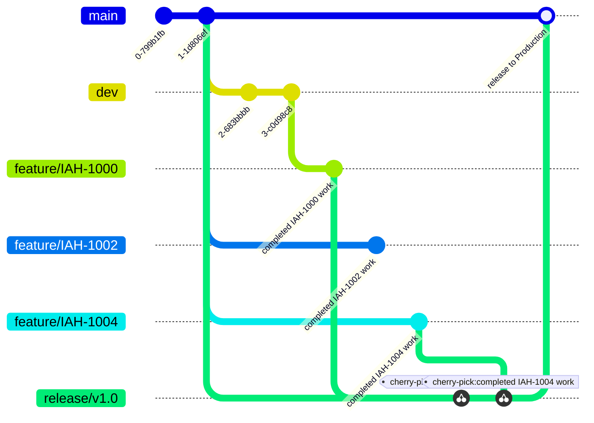

# Git Strategies Overview

This document presents five approaches to managing feature releases and environment flows. Each section includes a Mermaid gitGraph diagram, key pros/cons, and notes on database migration handling.

---

## 1. Trunk-Based Strategy

- When a new feature is being developed, a branch from development is made (eg feature/UAH-1000), 
- work is completed and then a Pull Request (MR/PR) is made to merge the completed work into Development.
- Once approved it is merged to Development, and the feature branch can be deleted.
- UAT is updated by a MR/PR from the Development branch to UAT. This is just a merging of the latest of Development on to UAT. 
- Then UAT is reviewed for all new featured added, and if approved a last MR/PR is created to merge UAT into Production, and when approved deploys out to Production.


**Pros**

* Minimal branching complexity
* Fast feedback; all code lands on trunk
* Easy CI/CD pipeline (every merge triggers deploy)
* No need to squash commits, leaves git history/easier reviews

**Cons**

* Harder to isolate unfinished features without flags
* Requires trunk (main) always stay stable

**DB Migrations**

* Chronological migrations on trunk
* Low risk of out-of-order migrations
* Rollbacks must be coordinated with code

---

## 2. Current UAT Strategy

- When a new feature is being developed, a branch from UAT is made (eg feature/IAH-1000), work is completed and pushed to origin, all commits are squashed. 
- A new branch is then created from Development and the feature branch is merged into that (merge/IAH-1000-into-dev), all conflicts are resolved. An MR/PR is made to merge the completed work into Development. 
- Once approved it is merged into Development. 
- At some point in the future a new UAT build will want to happen, so a new branch from UAT is created (release-uat). Into release-uat specific feature branches (eg. feature/IAH-1000, feature/IAH-1001, feature/IAH-1004) are merged, an MR/PR is then made to merge the work into UAT. There is no code review on this MR. 
- Then UAT is reviewed for all new featured added, and 
- if approved a final MR/PR is created to merge UAT into Production, and when approved deploys out to Production.


**Pros**

* Manual selection of features for UAT
* Squash commits enforce one-feature-one-commit

**Cons**

* High merge conflict surface (dev + release)
* Complex, cluttered branch history
* Manual tracking of which features in UAT

**DB Migrations**

* Migrations travel with each feature branch
* Cherry-picking can skip migrations, causing order issues
* Manual tracking required to include all needed migrations

---

## 3. Cherry-Pick Release Branch

- When a new feature is being developed, a branch from UAT is made (eg feature/IAH-1000), work is completed and pushed to origin, all commits are squashed. 
- A new branch is then created from Development and the feature branch is merged into that (merge/IAH-1000-into-dev), all conflicts are resolved. An MR/PR is made to merge the completed work into Development. 
- Once approved it is merged into Development. 
- At some point in the future a new UAT build will want to happen, so a new branch from UAT is created (release-uat). Into release-uat we cherry-pick feature branches (eg. feature/IAH-1000, feature/IAH-1001, feature/IAH-1004), an MR/PR is then made to merge the work into UAT. There is no code review on this MR.
- Then UAT is reviewed for all new featured added, and 
- if approved a final MR/PR is created to merge UAT into Production, and when approved deploys out to Production.



**Pros**

* Exact control over features in UAT
* develop remains integration branch

**Cons**

* Cherry-picks require conflict resolution per commit
* Potential to miss dependent migrations or code

**DB Migrations**

* Must cherry-pick migration commits
* Risk of out-of-order schema changes

---

## 5. Feature Flag Strategy

- When a new feature is being developed, the first thing to do is create a feature flag. This is normally done per "epic" rather than for each smaller feature. But use your discretion
- a branch from development is made (eg feature/UAH-1000),
- work is completed and then a Pull Request (MR/PR) is made to merge the completed work into Development.
- Once approved it is merged to Development, and the feature branch can be deleted.
- UAT is updated by a MR/PR from the Development branch to UAT. This is just a merging of the latest of Development on to UAT. 
- Then UAT is reviewed for all new featured added, and if approved a last MR/PR is created to merge UAT into Production, and when approved deploys out to Production.


**Pros**

* Decouples code merge from release toggle
* Low merge conflict surface (everything on trunk)
* QA enables flags selectively in UAT

**Cons**

* Requires flag infrastructure and lifecycle management
* Technical debt: flags must be cleaned up

**DB Migrations**

* Schema changes ship in trunk regardless of flags
* Chronological migrations preserved
* Safe incremental rollout behind flags

**Laravel Feature Flag Tools**

* [Pennant](https://laravel.com/docs/11.x/pennant) (First party)
* [FlagFox](https://www.flagfox.dev/) (Premium, not fully released yet)

**Further Reading**
* [Thoughtworks feature toggles series](https://www.thoughtworks.com/en-au/insights/blog/managing-feature-toggles-teams)

---

# Fixup and Autosquash

**Why it’s useful**

* Maintains a clean, logical history by merging minor corrections directly into the original commit instead of adding noise (e.g., `fix typo`, `remove console.log`)
* Improves review readability

**The painful way - Manual interactive rebase**

```bash
# 1. Save current changes
git stash

# 2. Launch interactive rebase, e.g. to edit the 3rd commit back
git rebase -i HEAD~3

#    In the editor that opens, change:
#      pick <hash> Commit message you want to amend
#    to:
#      edit <hash> Commit message you want to amend

# 3. When Git stops at that commit:
git stash apply        # re-apply your saved changes
git add path/to/file   # or 'git add .' to stage everything
git commit --amend     # amend the stopped commit with your new changes

# 4. Resume and finish the rebase
git rebase --continue
```

**How to use**

1. Stage your correction and commit with `--fixup`, referencing the original commit:

   ```bash
   git commit --fixup=<commit-hash>
   ```
2. Run an interactive rebase with autosquash enabled:

   ```bash
   git rebase -i --autosquash <base>
   ```

   Git automatically reorders and squashes `fixup!` commits into their targets.


**Further Reading**
* [Keep your branch clean](https://fle.github.io/git-tip-keep-your-branch-clean-with-fixup-and-autosquash.html)